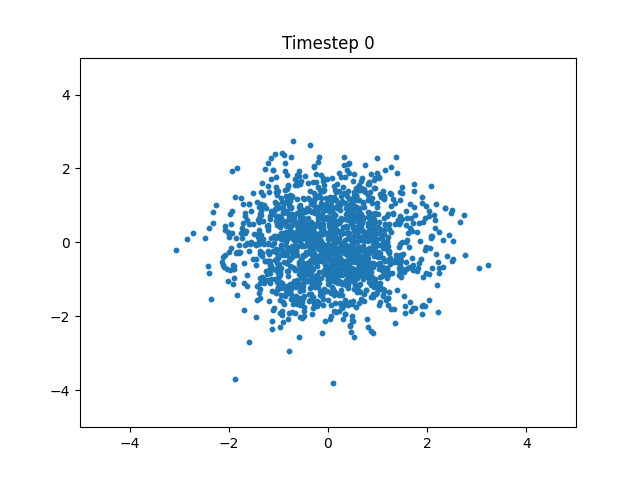
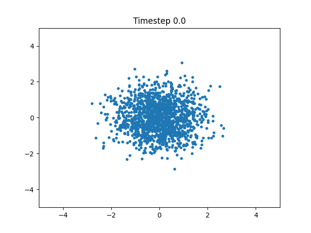

# Diffusion vs Flow Matching

This project explores and compares two generative modeling approaches: Diffusion Probabilistic Models (DDPM/DDIM) and Flow Matching (FM). I analyze their training dynamics, sampling quality, and performance on datasets like the Oxford Flowers and synthetic 2D data. My goal is to understand their trade-offs in terms of sample diversity, training efficiency, and architectural sensitivity.

While diffusion models have recently set state-of-the-art results on various image generation benchmarks, but they are notoriously slow at inference. Flow matching which is newer techique promises faster sampling with competitive quality. This project investigates how these methods compare both qualitatively and quantitatively.

flow matching - 97 secs on the batch of 128 imaegs
ddim:
- 36 secs on the batch of 128 images -- 50 timesteps
- 78 secs on the batch of 128 images -- 100 timesteps
- 113 secs on the batch of 128 images -- 150 timestesp

# Simple Diffusion vs Simple FM on simple star point cloud dataset

Below is the visualization of the sampling process of DDPM and Flow Matching (left and right gif accordingly). Both start from noise and gradually transform it into star over time but do it in different way.

As can be seen in visualization DDPM-predicted points move chaotically throughout different timesteps and slowly become less and less noisy until they eventually become the star, flow matching predictions tend to move slowly towards the center without any chaotic or random motion, it is like the points are being pulled toward the center to form a star in the end.
<table> 
  <tr>
    <td></td>
    <td></td>
  </tr>
</table>
