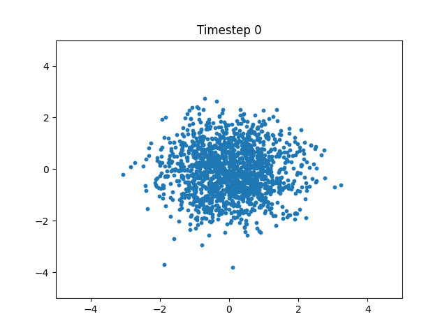
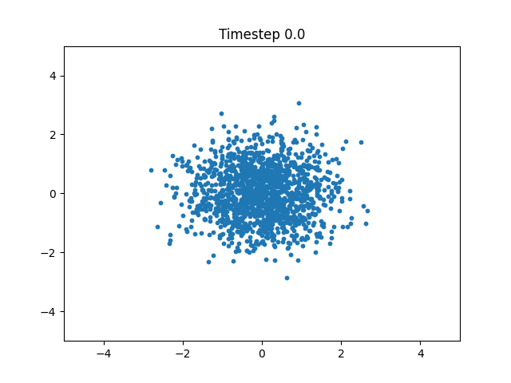
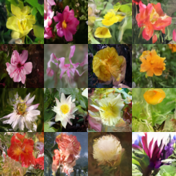
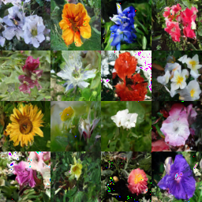

# Diffusion vs Flow Matching

This project explores and compares two generative modeling approaches: Diffusion Probabilistic Models (DDPM/DDIM) and Flow Matching (FM). I analyze their training dynamics, sampling quality, and performance on datasets like the Oxford Flowers and synthetic 2D data. My goal is to understand their trade-offs in terms of sample diversity, training efficiency, and architectural sensitivity.

While diffusion models have recently set state-of-the-art results on various image generation benchmarks, but they are notoriously slow at inference. Flow matching which is newer techique promises faster sampling with competitive quality. This project investigates how these methods compare both qualitatively and quantitatively.

# Simple Diffusion vs Simple FM on simple star point cloud dataset

Below is the visualization of the sampling process of DDPM and Flow Matching (left and right gif accordingly). Both start from noise and gradually transform the points until they form the star — but they do it in very different ways.

As can be seen in visualization DDPM-predicted points move chaotically throughout different timesteps and slowly become less and less noisy until they eventually become the star, flow matching predictions tend to move slowly towards the center without any chaotic or random motion, it is like the points are being pulled toward the center to form a star in the end.
<table> 
  <tr>
    <td align="center"><strong>DDPM</strong></td>
    <td align="center"><strong>Flow Matching</strong></td>
  </tr>
  <tr>
    <td></td>
    <td></td>
  </tr>
</table>

# Diffusion vs Flow Matching with UNet as backbone

Two different models were trained on Oxford Flowers 102, both uses UNet model as base model predicting noise/velocity. 

The models were evaluated in terms of:
* Sample quality (visual fidelity of generated flowers)
* Sampling speed (inference efficiency)
* Training dynamics (loss behaviour, stability)

Despite using the same backbone, the two approaches differ fundamentally in how they model the data distribution:    
* DDPM learns to denoise images over hundreds of discrete timesteps. While it produces high-quality results, it requires many forward passes for a single image. In this work, DDIM approach is used for sampling, which preserves the training framework of DDPM but introduces a deterministic and significantly faster sampling procedure.     
* Flow Matching learns a continuous transport field, enabling much faster sampling in a single ODE/SDE solve. It captures global structure early and converges faster during training.

## Sampling quality comparison:
<table>
  <tr>
    <td align="center"><strong>DDPM Output</strong></td>
    <td align="center"><strong>Flow Matching Output</strong></td>
  </tr>
  <tr>
    <td></td>
    <td></td>
  </tr>
</table>

Some flow matching samples exhibit color bleeding and pixel-level noise which may be caused by some instabilities in training or insufficient model capacity since the entire training process took place under limited GPU resources conditions.

DDPM samples do not have any artifacts or noises, but it did not fully trained to generate flower petals properly: they have unnaturaly sharp edges, which can also be explained by limited GPU resources.

Overall, models' quality is decent and outputs reasonably resemble the distribution found in the Oxford Flowers dataset. 
