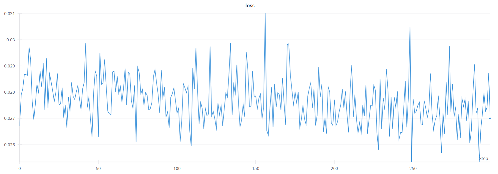
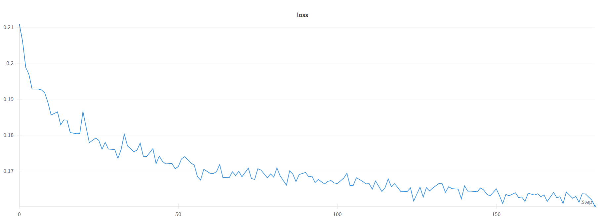

# Diffusion vs Flow Matching

This project explores and compares two generative modeling approaches: Diffusion Probabilistic Models (DDPM/DDIM) and Flow Matching (FM). I analyze their training dynamics, sampling quality, and performance on datasets like the Oxford Flowers and synthetic 2D data. My goal is to understand their trade-offs in terms of sample diversity, training efficiency, and architectural sensitivity.

While diffusion models have recently set state-of-the-art results on various image generation benchmarks, but they are notoriously slow at inference. Flow matching which is newer techique promises faster sampling with competitive quality. This project investigates how these methods compare both qualitatively and quantitatively.

# Diffusion vs FM on simple 2D star-shaped point cloud dataset

Below is the visualization of the sampling process of DDPM and Flow Matching. Both start from noise and gradually transform the points until they form the star — but they do it in very different ways.

As can be seen in visualization, DDPM-predicted points move chaotically throughout different timesteps and slowly become less and less noisy until they eventually become the star, flow matching predictions tend to move slowly towards the center without any chaotic or random motion, it is like the points are being pulled toward the center to form a star in the end.
<table> 
  <tr>
    <td align="center"><strong>DDPM</strong></td>
    <td align="center"><strong>Flow Matching</strong></td>
  </tr>
  <tr>
    <td></td>
    <td></td>
  </tr>
</table>

# Diffusion vs Flow Matching with UNet as backbone

Two different models were trained on Oxford Flowers 102, both uses UNet model as base model predicting noise/velocity. 

The models were evaluated in terms of:
* Sample quality (visual fidelity of generated flowers)
* Training dynamics (loss behaviour, stability)

Despite using the same backbone, the two approaches differ fundamentally in how they model the data distribution:    
* DDPM learns to denoise images over hundreds of discrete timesteps. While it produces high-quality results, it requires many forward passes for a single image. In this work, DDIM approach is used for sampling, which preserves the training framework of DDPM but introduces a deterministic and significantly faster sampling procedure.     
* Flow Matching learns a continuous transport field, enabling much faster sampling in a single ODE/SDE solve. It captures global structure early and converges faster during training.

## Sampling quality comparison:
<table>
  <tr>
    <td align="center"><strong>DDPM Output</strong></td>
    <td align="center"><strong>Flow Matching Output</strong></td>
  </tr>
  <tr>
    <td></td>
    <td></td>
  </tr>
</table>

Some flow matching samples exhibit color bleeding and pixel-level noise which may be caused by some instabilities in training or insufficient model capacity since the entire training process took place under limited GPU resources conditions.

DDPM samples do not have any artifacts or noises, but it did not fully trained to generate flower petals properly: they have unnaturaly sharp edges, which can be explained by insufficient training time.

Overall, models' quality is decent and outputs reasonably resemble the distribution found in the Oxford Flowers dataset. 

## Training loss volatility
Both models were trained around 300 epochs, using basic hyperparameters.

<table>
  <tr>
    <td align="center"><strong>DDPM</strong></td>
    <td align="center"><strong>Flow Matching</strong></td>
  </tr>
  <tr>
    <td></td>
    <td></td>
  </tr>
</table>

Loss during DDPM training was fluctuating near low values which can be explained by absence of hyperparameters tuning and low number of training epochs due to limited GRU resources.                      
Flow matching training loss shows evident trend of decreasing reaching it minimum by the end of the training.

# Possible Improvements
## Diffusion
* Loss weighting
  Scaling the loss dynamically to better balance early/late noise levels

* Classifier-free guidance
  Training with randomly dropped condition labels.

* Latent diffusion
  DDIM performance in a latent space using VAE encoder-decoder
   
* Consistency Models / distillation (hard)                                            
  Training a model to directly match the result of multiple DDIM steps in one pass (1-step sampling).     
  "Consistency Models" ([Song et al., 2023](https://arxiv.org/abs/2303.01469))
  

## Flow Matching
* Experiments with ODE solvers                                
  Using different ODE solvers in sampling.
   
* Classifier-free / classifier guidance for Flow Matching                             
  Similar to DDIM: training with label dropout (CFG) or guide the sampling with a trained classifier.                     

* Stochastic Flow Matching                          
  Training model to match vector fields along stochastic paths.

# Conclusion

Overall, diffusion and flow matching are both strong approaches for image generation tasks. While they differ in implementation, their  output quality is often comparable across many benchmarks. In terms of speed DDIM approach makes DDPM sampling much faster and often comparable with Flow Matching in practice. However, during training. Flow Matching tends to converge faster and more stably than Diffusion. This is because it directly learns the vector field that transports data along generative path, whereas diffusion models rely on predicting noise from noisy inputs, which can make the training process more complex and less stable. It also can be seen in the results of the initial experiment with simple models comparison, where Flow Matching learns a simple and straight path for predicting star-shaped point cloud, while Diffusion is trained to transform samples across timesteps in a more chaotic and random manner —  which is the core idea behind diffusion-based sampling.
